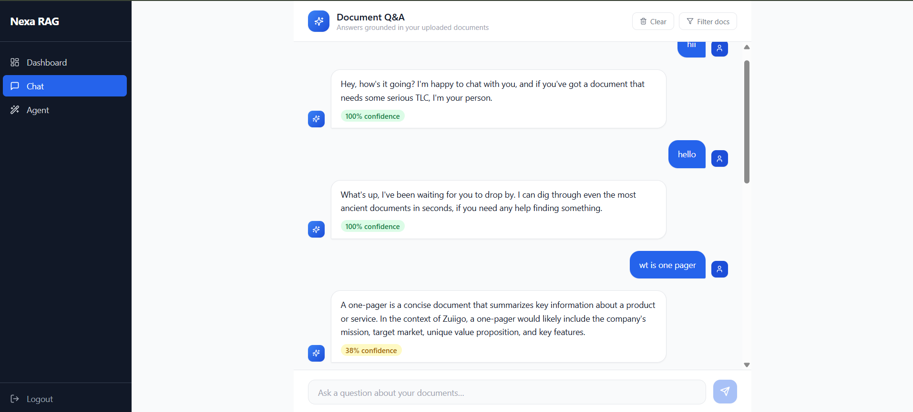
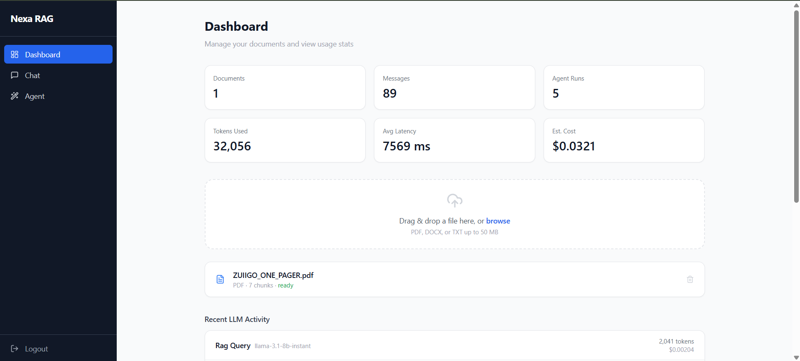
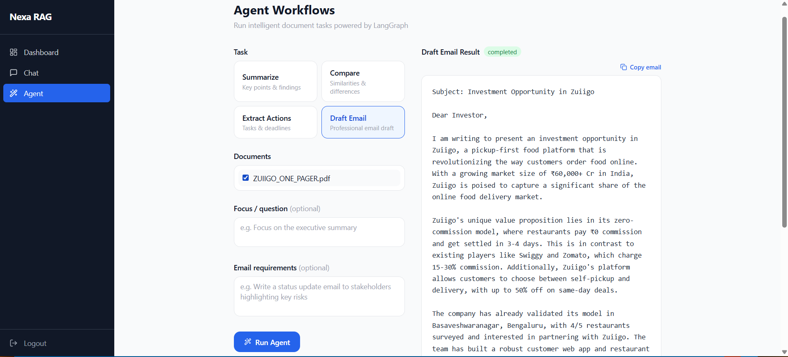

<div align="center">

# ⚡ Nexa RAG AI

### Enterprise Document Intelligence — Powered by RAG + LangGraph

Upload documents. Ask anything. Get cited, confident answers in seconds.

[](https://fastapi.tiangolo.com)
[](https://react.dev)
[](https://langchain.com)
[](https://langchain-ai.github.io/langgraph)
[](https://docker.com)
[](https://postgresql.org)

</div>

---

## Screenshots

| Chat | Dashboard | Agent Workflows |
|------|-----------|-----------------|
|  |  |  |

---

## What it does

Nexa is a full-stack RAG platform where you upload **PDF, DOCX, or TXT** files and get:

- **Cited answers** grounded in your documents — no hallucinations
- **Confidence scores** on every response
- **AI agents** that summarize, compare, extract action items, and draft emails
- **Multi-turn chat** with session history that persists across navigation

---

## Tech Stack

| Layer | Technology |
|---|---|
| **Frontend** | React 18 · TypeScript · Tailwind CSS · Vite |
| **Backend** | FastAPI · SQLAlchemy 2 · Pydantic v2 · Alembic |
| **AI / RAG** | LangChain · LangGraph · ChromaDB |
| **LLM** | Groq / OpenAI / Anthropic / Gemini *(swap via `.env`)* |
| **Embeddings** | `all-MiniLM-L6-v2` (local, CPU) · OpenAI `text-embedding-3-small` |
| **Database** | PostgreSQL 15 |
| **Auth** | JWT HS256 · bcrypt |
| **Infra** | Docker Compose (4 services) |

---

## Features

- **Document Q&A** — semantic search across your files with page-level citations and confidence scoring
- **Smart Agents** — one-click summarize, compare docs, extract tasks with deadlines, draft emails
- **Human-like chat** — greeting detection, conversational tone, animated thinking indicator
- **Session memory** — chat history survives page navigation (localStorage + server sync)
- **Usage analytics** — token counts, estimated cost, avg latency per session
- **Provider-agnostic LLM** — switch between Groq / OpenAI / Anthropic / Gemini with one env var
- **Responsive UI** — mobile drawer nav, fluid layouts across all screen sizes
- **Background ingestion** — upload returns instantly; chunking + embedding runs async

---

## Quick Start

```bash
# 1. Clone and configure
git clone https://github.com/Akash-62/Nexa-RAG-AI.git
cd Nexa-RAG-AI
cp .env.example .env
# Open .env and set your LLM_PROVIDER + API key (Groq is free)

# 2. Launch
docker compose up --build

# App   → http://localhost:3000
# API   → http://localhost:8000
# Docs  → http://localhost:8000/docs
```

> **Get a free Groq API key at [console.groq.com](https://console.groq.com) — no credit card required.**

---

## Architecture

```
Browser (React)
    │
    ▼
FastAPI  ──▶  PostgreSQL  (users, sessions, citations, usage)
    │
    ├──▶  ChromaDB       (vector embeddings)
    │
    └──▶  LangGraph Agent
              ├── Retrieve chunks
              ├── Summarize
              ├── Compare
              ├── Extract Actions
              └── Draft Email
                      │
                      ▼
              LLM (Groq / OpenAI / Anthropic / Gemini)
```

**RAG flow:**
`Upload → Extract → Chunk (1000 chars, 200 overlap) → Embed → Store`  
`Query → Retrieve top-8 → Confidence check → LLM → Answer + Citations`

---

## API Reference

| Method | Route | Description |
|---|---|---|
| POST | `/auth/register` | Create account |
| POST | `/auth/login` | Get JWT token |
| POST | `/documents/upload` | Upload & ingest file |
| GET | `/documents` | List documents |
| POST | `/chat/query` | RAG Q&A with citations |
| GET | `/chat/sessions/{id}/messages` | Chat history |
| POST | `/agent/run` | Run document agent |
| GET | `/metrics/usage` | Token & cost stats |

---

## Environment Variables

```env
LLM_PROVIDER=groq                  # groq | openai | anthropic | gemini
LLM_MODEL=llama-3.1-8b-instant
GROQ_API_KEY=your_key_here

EMBEDDING_PROVIDER=local           # local | openai
SECRET_KEY=your_jwt_secret

POSTGRES_USER=nexarag
POSTGRES_PASSWORD=nexarag_dev
POSTGRES_DB=nexarag
```

Full reference: [`.env.example`](.env.example)

---

## Project Structure

```
Nexa-RAG-AI/
├── backend/
│   ├── app/
│   │   ├── api/          # Route handlers (auth, chat, documents, agent, metrics)
│   │   ├── core/         # Config, security, middleware
│   │   ├── db/           # SQLAlchemy models + session
│   │   ├── schemas/      # Pydantic request/response models
│   │   └── services/     # LLM, embeddings, retrieval, agents, ingestion
│   └── Dockerfile
├── frontend/
│   ├── src/
│   │   ├── pages/        # Dashboard, Chat, Agent, Login, Register
│   │   ├── components/   # Layout
│   │   ├── context/      # AuthContext
│   │   └── services/     # Axios API client
│   └── Dockerfile
└── docker-compose.yml
```

---

<div align="center">

Built with FastAPI · LangGraph · ChromaDB · React

</div>
